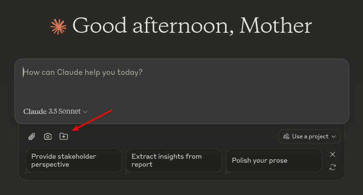

# Folders for Claude.AI

This small extension injects the Folder upload button next to file upload to allow for multiple file uploads at once, while respecting Claude's supported file formats. 



## Under the limit

If your folder has up to 5 files, each file would be uploaded as is with no modifications.

## Combined folder contents 

Since Claude has a 5 file upload limit, if your folder contains more files, the folder will be combined into a single file, preserving the directory structure and file names.

For example if your folder looks like this:

```
.
└── ClaudeFoldersTest
    ├── file1.txt
    ├── file2.txt
    ├── subfolder
    │   └── file3.txt
    ├── subfolder2
    │   ├── file4.txt
    │   └── file5.txt
    └── subfolder3
        └── file6.txt

5 directories, 6 files

```

The extension will then upload a file named `ClaudeFoldersTest-combined.txt` with contents like this:

```
[File]: file1.txt
contents of file 1

[File]: file2.txt
contents of file 2

[File]: subfolder/file3.txt
contents of file 3 in subfolder

[File]: subfolder2/file4.txt
contents of file 4

[File]: subfolder2/file5.txt
contents of file 5

[File]: subfolder3/file6.txt
contents of file 6
```

This is very useful for programming needs as it allows you to combine all your code files into a single file to feed Claude.

## Ignored files 

To include some safety considerations all files that are starting with `.filename` are ignored (.env files for example) and not sent to Claude.

Additionally, in the combined mode where there is more than 5 files, images are uploaded only as <image_content> excluding the file's actual content to keep the context length reasonable.

# Installation 

To install the extension to Chrome:
* Checkout or download the git repository from the releases (link)[https://github.com/duck4i/folders-for-claude-ai/releases].
* Navigate to `chrome://extensions/` URL.
* Click `Load unpacked` and point to the downloaded location.

If there is enough traction I will be happy to release this plugin to Chrome marketplace.